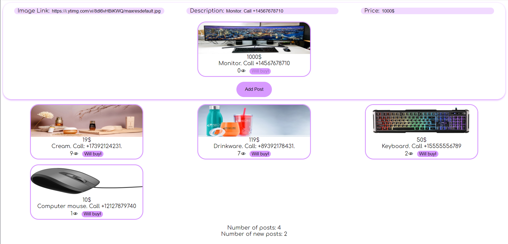

# SellThings
This web application is a demonstration of concepts of microservices and containers. As a result of such implementation, this application can be easily updated with new features and scaled by starting copies of the program in Docker containers.

### Render Link (Cloud Application Hosting):

### Screenshot:

## How to use:
1) Download the repository
2) Open the repository
3) Enter "docker compose up" command
4) Go to http://127.0.0.1:3000/ in browser

